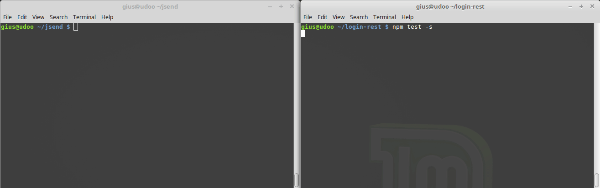

# JSend

Implementation of jsend with:

1. All responses return json (including errors)
2. Limit HTTP.status to
   - 200 OK
   - 400 BAD REQUEST (client fault)
   - 500 INTERNAL SERVER ERROR (server fault)
3. On top of 1 and 2, use [jsend](https://github.com/omniti-labs/jsend) standard, but all 4 fields are always returned:
   - status - [OK,FAIL,ERROR],
   - data - the data or the stack
   - message - shortest message possible
   - code - [200,400,500]

# Install

With SSH:

```bash
git clone git@github.com:rkristelijn/jsend.git
cd jsend && npm i
```

With HTTP:

```bash
git clone https://github.com/rkristelijn/jsend.git
cd jsend && npm i
```

# Usage

| purpose | command                                 |
| ------- | --------------------------------------- |
| start   | `npm start -s`                          |
| test    | `npm test -s` (after server is running) |

# Demo



# Responses

## /

```json
{
  "status": "SUCCESS",
  "data": {
    "hello": "world",
    "api": "http://localhost:3000/api"
  },
  "message": "200: OK",
  "code": 200
}
```

## /api

```json
{
  "status": "FAIL",
  "message": "Route '/api' not found",
  "data": [
    "400: BAD REQUEST",
    "Route '/api' not found",
    {
      "available": [
        ["http://localhost:3000/api/users", "http://localhost:3000/api/fail"]
      ]
    }
  ],
  "code": 400
}
```

## /api/users

```json
{
  "status": "SUCCESS",
  "data": {
    "users": [
      {
        "name": "admin",
        "pass": "admin"
      },
      {
        "name": "system",
        "pass": "system"
      },
      {
        "name": "henk",
        "pass": "annie"
      }
    ]
  },
  "message": "200: OK",
  "code": 200
}
```

## /api/users/henk

```json
{
  "status": "SUCCESS",
  "data": {
    "user": {
      "name": "henk",
      "pass": "annie"
    }
  },
  "message": "200: OK",
  "code": 200
}
```

## /api/fail

I purposely created an error, calling `i_will_crash_on_purpose()` that doesn't exist to see if a proper JSON is returned.

```json
{
  "status": "ERROR",
  "message": "i_will_crash_on_purpose is not defined",
  "data": [
    "500: INTERNAL SERVER ERROR",
    "ReferenceError: i_will_crash_on_purpose is not defined",
    "at /home/gius/jsend/api/fail/fail-router.js:10:5"
  ],
  "code": 500
}
```

# Key take-aways

## npm WARN

Ignore the WARN per heavily discussed fsevent optional dependency for chokidar (via nodemon) in npm [here](https://github.com/yarnpkg/yarn/issues/3738) on non-mac systems. There seems no way around it, like I did with the jQuery dependency [here](https://github.com/rkristelijn/login)

## console.log() vs debug()

Debug comes as a dependency of express. Debug can be tailored at the beginning of every file and filtered while starting the app.

you can use a .env file and [dotenv](https://www.npmjs.com/package/dotenv) or simply add the following to the start script in package.json:

```json
"scripts": {
    "start": "PORT=3000 DEBUG=jsend* nodemon ./bin/www"
```

## Custom validators in test

To keep the test clean, I've written 3 simple validators for jsend that can be reused and keep the test themselves short, manageable and reusable.

## e2e test without bootstrapping the app

The test might as well skip setting up the app in before(). This removes redundant code, makes the test simpler and test the actual app.

## Arrow-functions / lambdas in test

This is not best practice because of this scope is gone. Mocha strongly [advices to avoid lambda's in test](https://mochajs.org/#arrow-functions):

_Passing arrow functions (aka "lambdas") to Mocha is discouraged. Lambdas lexically bind this and cannot access the Mocha context._

# Sources

- [question about JSON Standards](https://stackoverflow.com/questions/12806386/standard-json-api-response-format)
- [already existing implementation of jsend](https://jsonapi.org/implementations/#server-libraries-node-js)
- [scalable promised base lib](https://medium.com/@rossbulat/building-a-scalable-promise-based-nodejs-library-for-your-apps-cf669de03bfb)
- [explicit-construction anti-pattern](https://stackoverflow.com/questions/23803743/what-is-the-explicit-promise-construction-antipattern-and-how-do-i-avoid-it)
- [Promise anti-patterns](https://github.com/petkaantonov/bluebird/wiki/Promise-anti-patterns#the-deferred-anti-pattern)
- [9 promising promise tips](https://dev.to/kepta/promising-promise-tips--c8f) **Read tip**
- [node require env path](https://gist.github.com/branneman/8048520#5-the-environment)
- [error handling in node](https://expressjs.com/en/guide/error-handling.html)
